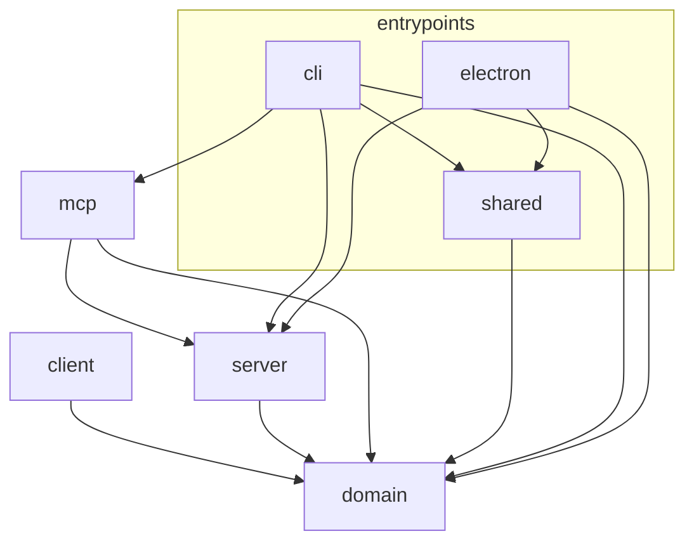

# Architecture

## Project Overview

The application consists of:

- A Hono-based server that reads local Git state through CLI adapters
- A React frontend for visualizing diffs and repository state
- A CLI entry point that resolves repositories, starts the server, and opens the browser
- An MCP server that exposes Notes to AI agent hosts over stdio, as a thin client of the same Hono
  server's HTTP API

## Repository Layout

```text
src/
├── entrypoints/  # Program entry points that host the product on a runtime
│   ├── cli/        # CLI entry point (commander, repo resolution, browser opener, mcp wiring)
│   ├── electron/   # Electron main process entry point (standalone GUI app)
│   └── shared/     # Contract shared between entry points (no runtime-specific code)
├── server/       # Hono HTTP server (contract, routes, services, watch, infrastructure)
├── mcp/          # MCP stdio protocol adapter; a thin client of server/'s HTTP API
├── client/       # React frontend (application ports, infrastructure, hooks, components, styles)
└── domain/       # Pure business logic and models shared across server and client
```

`domain/`, `server/`, `mcp/`, and `client/` are the building-block libraries; `entrypoints/*` are
the runnable deliverables that compose them for a specific runtime (CLI today, Electron desktop app,
and potentially others such as a VS Code extension).

Code shared between sibling entry points lives in `entrypoints/shared/`, keeping such cross-host
contracts out of `domain/` (which is reserved for pure business logic shared by `server`/`client`).

`mcp/` sits alongside `server/` rather than under `entrypoints/` because it is not itself a process
entry point (only `entrypoints/cli`'s `mcp` subcommand is). It is a protocol adapter with the same
role as `server/`: `server/` adapts `domain/` to HTTP, `mcp/` adapts the same functionality to the
MCP stdio protocol by calling `server/`'s HTTP API.

## Dependency Overview



## How These Rules Are Enforced

`eslint.boundaries.js` is the executable form of the dependency rules described below: every allowed
edge is listed there and anything not listed is a lint error. Rules that a folder-level edge cannot
express are bans on named modules, and live in `eslint.config.js` as `no-restricted-imports`. Run
`pnpm run lint` to check them.

Some rules are documented here but **not** tool-enforced, because they are file-level, semantic, or
not expressible as import restrictions at all:

- the rules distinguishing `server/create-app.ts` from `server/index.ts` for callers that may
  legitimately import both (`entrypoints/`)
- whether a component reused across `components/<name>/` directories is presentation-focused
- keeping browser runtime APIs out of `application/` and `presentation/`, since those are globals
  rather than imports

Unclassified source files and unresolved or unclassified local imports are lint errors, so boundary
checks fail closed when a new layer is added or import resolution stops working.

## Domain Layer

`domain/` contains shared models and pure business logic, with no external, Node.js, or browser
dependencies.

For Sift's internal HTTP APIs, successful response bodies may intentionally use domain models
directly when the payload represents the same business concept without transport-specific fields.
This avoids duplicating internal API DTOs that would have the same shape as domain models.

Transport-specific concerns must stay outside `domain/`. Examples include HTTP status codes, request
parsing errors, and `{ error: string }` error response bodies. Do not add fields to domain models
solely to encode HTTP state.

## Entry Points Layer

`entrypoints/` groups the program entry points that turn the building-block layers into a runnable
product for a specific runtime. Each subdirectory is one such entry point.

The only dependency allowed between sibling entry points is through `shared/`: an entry point must
not import from another entry point directly. `shared/` holds contracts that are not domain business
logic and must stay free of runtime-specific APIs.

- `entrypoints/cli/` owns repository resolution, local config editing, browser/server startup
  wiring, and the `mcp` subcommand's stdio startup wiring.
- `entrypoints/electron/` is the Electron main process. It starts the Hono server via `server/`,
  renders `client/` in a `BrowserWindow`, and manages the window lifecycle. It loads `client/` as
  built assets rather than importing its source.

## Client Layer

- `App.tsx` selects the route-level page and passes application-level dependencies and navigation
  callbacks. Business logic must not be added to `App.tsx` or page components; extract it to a hook
  or a pure function. Neither should own low-level reusable UI details.
- `pages/` contains route-level React composition for complete screens. Pages may compose hooks from
  multiple feature areas and pass injected dependencies into hooks; runtime dependencies arrive
  through props from `main.tsx` or `composition/`. Pages are the preferred place for cross-feature
  hook composition, which would otherwise violate the `hooks/<feature>/` boundaries.
- `application/` defines client-side ports and pure application policies, independent of React and
  browser APIs.
- `composition/` wires infrastructure implementations to application ports.
- `infrastructure/` implements `application/` ports and may use browser APIs.
- `presentation/` contains pure UI and interaction logic that is not React-specific, such as layout
  calculations, display formatting, UI-only selection helpers, and style/ARIA value helpers. Like
  `application/`, it must stay free of React and browser runtime APIs.
- `hooks/<feature>/` contains React hooks for one feature area. A feature must not import from
  another feature; compose them in `pages/` or in a top-level composition hook placed directly under
  `hooks/`. Such a composition hook may import feature hooks, but is otherwise held to the same
  restrictions as one.
- `components/<name>/` contains React UI components and component-local interaction logic. Hooks
  used only by one component may be colocated inside its directory. A component directory may reuse
  a component from another `components/<name>/` directory when the imported component is
  presentation-focused and does not pull in hooks, composition, infrastructure, or feature-specific
  state — for example, a diff component may reuse note UI components.
- `styles/` and `types/` hold CSS and ambient type declarations only; they own no logic.

## Server Layer

- `contract/` holds the HTTP wire contract that callers outside the server also have to understand:
  the error response `code` values and the health response's product marker and capabilities. It is
  pure — only `domain/` and relative imports — so that `mcp/` can consume the contract without
  depending on route implementations.
- `routes/` handles HTTP routing and response shaping only. Runtime dependencies are passed in
  through route factory options from `create-app.ts`, so routes must not construct infrastructure
  implementations, and values that are only knowable at runtime are injected rather than read/built
  here. `env.ts` owns the Hono `Env` generic shared by every router.
- `services/` defines server-side ports and error classes, free of Node.js runtime APIs.
- `watch/` contains the watch subsystem interfaces and pure orchestration. Concrete watcher creation
  is injected through `CreateRepoWatchManagerOptions`, so `watch/` itself must not reach for
  chokidar, Git CLI adapters, or filesystem APIs.
- `infrastructure/` implements server ports and runtime adapters. It is the place for accessing
  Node.js APIs, Git, and the filesystem. Config file I/O, schema parsing, path normalization, and
  the default config path live in `infrastructure/config/`.
- `create-app.ts` is the route-level composition root. It wires route factories to service ports and
  infrastructure implementations, and may import from all server layers except `index.ts`. It should
  not own long-lived runtime lifecycle; pass runtime-owned resources in through `CreateAppOptions`.
- `index.ts` is the runtime composition root. It owns server startup, static file serving, signal
  cleanup, config watcher lifecycle, and watch manager lifecycle.

### Server Testing

Route tests should mock service and watch ports directly rather than instantiating infrastructure
implementations. See AGENTS.md for the project-wide rule on avoiding real Git and filesystem access.

## MCP Layer

`mcp/` exposes Notes to MCP hosts (AI agents) over stdio as a thin client of `server/`'s HTTP API.
It reads the wire contract from `server/contract/` and uses shared utilities from the server root;
it never reaches into `routes/`, `services/`, or `infrastructure/`. `entrypoints/cli` injects
CLI-level values into `mcp/` to keep dependencies one-directional.

Being a protocol adapter, this layer is organized around the MCP specification rather than a fixed
set of modules, so it is described by the rules that hold across spec revisions rather than file by
file. Details tied to one revision of the protocol are documented at their point of use.

- It holds no Notes business logic. Target resolution, reconcile, and generation diffing stay on the
  server; this layer only translates between MCP tool calls and HTTP requests and responses.
- It connects to an already-running Sift HTTP server, and never starts, stops, or manages one.
- It validates the runtime boundary with Zod schemas, covering both MCP tool inputs/outputs and HTTP
  responses, so transport contracts are enforced without leaking validation rules into `domain/`.
- It resolves the repository root lazily, on the first tool invocation, so opening a connection and
  answering `tools/list` succeeds without a confirmed git repository.
- It keeps construction of a per-connection server instance side-effect free, because a host may
  build and discard an instance while negotiating how to talk to it.
