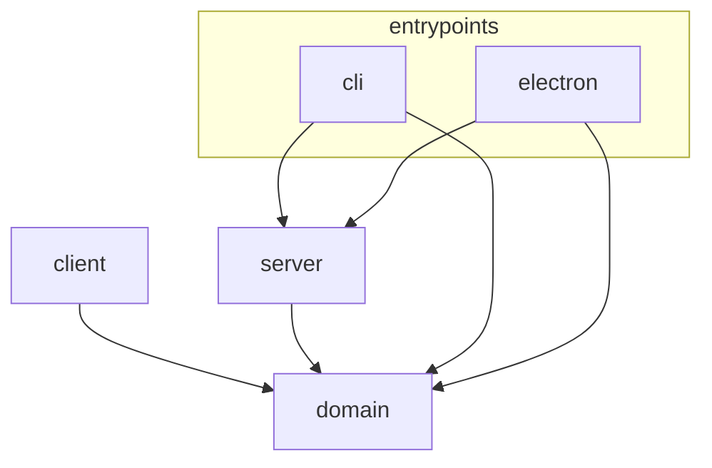

# Architecture

## Project Overview

The application consists of:

- A Hono-based server that reads local Git state through CLI adapters
- A React frontend for visualizing diffs and repository state
- A CLI entry point that resolves repositories, starts the server, and opens the browser

## Repository Layout

```text
src/
├── entrypoints/  # Program entry points that host the product on a runtime
│   ├── cli/        # CLI entry point (commander, repo resolution, browser opener)
│   └── electron/   # Electron main process entry point (standalone GUI app)
├── server/       # Hono HTTP server (routes, services, watch, infrastructure)
├── client/       # React frontend (application ports, infrastructure, hooks, components, styles)
└── domain/       # Pure business logic and models shared across server and client
```

Code shared between sibling entry points lives in an `entrypoints/shared/` subdirectory, introduced
when the first such dependency appears.

`domain/`, `server/`, and `client/` are the building-block libraries; `entrypoints/*` are the
runnable deliverables that compose them for a specific runtime (CLI today, Electron desktop app, and
potentially others such as a VS Code extension).

Top-level dependency rules:

- `domain/` contains pure logic with no framework, Node.js, browser, or infrastructure dependencies.
- `server/` depends on `domain/` and Node.js APIs. It must not import from `client/`.
- `client/` depends on `domain/` and React. It must not import from `server/` or `entrypoints/`.
- `entrypoints/` groups the program entry points. Each entry point wires together `server/` (and, for
  GUI runtimes, renders `client/`) for one runtime. See the Entry Points Layer below for the rules
  among its subdirectories.

## Dependency Overview



## Domain Layer

`domain/` contains shared models and pure business logic.

For Sift's internal HTTP APIs, successful response bodies may intentionally use domain models
directly when the payload represents the same business concept without transport-specific fields.
This avoids duplicating internal API DTOs that would have the same shape as domain models.

Transport-specific concerns must stay outside `domain/`. Examples include HTTP status codes, request
parsing errors, and `{ error: string }` error response bodies. Do not add fields to domain models
solely to encode HTTP state.

Allowed dependencies:

- TypeScript standard language features
- Other files within `domain/`

Disallowed dependencies:

- Other directories, External modules, Node.js APIs, Browser runtime APIs

## Entry Points Layer

`entrypoints/` groups the program entry points that turn the building-block layers into a runnable
product for a specific runtime. Each subdirectory is one such entry point; `shared/` holds the
contract common to them.

The only dependency allowed between sibling entry points is through `shared/`: an entry point must
not import from another entry point directly (e.g. `cli/` must not import from `electron/`).

### `entrypoints/shared/`

Contract shared between entry points that is not domain business logic. Introduced when the first
cross-entry-point dependency appears.

- Allowed dependencies: `domain/`, and within `shared/`.
- Disallowed dependencies: any entry-point subdirectory (`cli/`, `electron/`, …), `server/`,
  `client/`, and runtime-specific APIs (Node.js, Electron, browser).

### `entrypoints/cli/`

The command-line entry point: repository resolution, local config editing, and browser/server
startup wiring.

- Allowed dependencies: `entrypoints/shared/`, `domain/`, `server/`, Node.js APIs.
- Disallowed dependencies: other entry-point subdirectories (e.g. `electron/`), `client/`.

### `entrypoints/electron/`

The Electron main process entry point. It starts the Hono server via `startServerWithHandle` from
`server/`, renders `client/` in a `BrowserWindow`, and manages the window lifecycle.

- Allowed dependencies: `entrypoints/shared/`, `domain/`, `server/`, Electron, Node.js APIs.
- Disallowed dependencies: other entry-point subdirectories (e.g. `cli/`), `client/` source (it is
  loaded as built assets, not imported).

## Client Layer

- `App.tsx` is responsible for selecting the route-level page and passing application-level
  dependencies and navigation callbacks.
- `pages/` contains route-level React components. Pages may compose hooks from multiple feature
  areas, render page-level JSX, and pass injected dependencies into hooks. Pages must not import
  from `infrastructure/`; runtime dependencies are passed in through props from `main.tsx` or
  `composition/`.
- Business logic must not be added directly to `App.tsx` or page components; extract it to a hook or
  a pure function instead.
- `App.tsx` and pages should not own low-level reusable UI details. Extract reusable UI to
  `components/` and React-independent UI logic to `presentation/`.

### Client Responsibilities And Import Restrictions

- `pages/` contains route-level React composition for complete screens.
  - It may import from `hooks/`, `components/`, `presentation/`, `application/`, `composition/`, and
    `domain/`.
  - It must not import from `infrastructure/`.
  - It is the preferred place for cross-feature hook composition that would violate
    `hooks/<feature>/` boundaries if placed inside a feature hook directory.
- `application/` defines client-side ports and pure application policies.
  - It may import from `domain/`, but must not import from `hooks/`, `components/`, or
    `infrastructure/` and must not import React or browser runtime APIs.
- `composition/` wires infrastructure implementations to application ports.
  - It may import from `application/` and `infrastructure/`, but must not import from `hooks/` or
    `components/`.
- `infrastructure/` implements `application/` ports and may use browser APIs.
  - It must not import from `hooks/` or `components/`.
- `presentation/` contains pure UI and interaction logic that is not React-specific, such as layout
  calculations, display formatting, UI-only selection helpers, and style/ARIA value helpers.
  - It may import from `domain/` and from within `presentation/`.
  - It must not import from `application/`, `infrastructure/`, `composition/`, `hooks/`,
    `components/`, React, or browser runtime APIs.
- `hooks/<feature>/` contains React hooks for one feature area.
  - A hooks subdirectory may import from itself, `application/`, `presentation/`, and `domain/`.
  - It must not import from another hooks subdirectory, `components/`, or `infrastructure/`.
    Cross-feature hook composition belongs in `pages/`, or a top-level composition hook.
- `components/<name>/` contains React UI components and component-local interaction logic.
  - A component directory may import from itself, `application/`, `presentation/`, and `domain/`.
  - It may import reusable UI components from another `components/<name>/` directory when the
    imported component is presentation-focused and does not pull in hooks, composition,
    infrastructure, or feature-specific state. For example, a diff component may reuse note UI
    components.
  - It must not import from `infrastructure/`, `composition/`, or non-colocated `hooks/`.
  - Hooks used only by a component may be colocated inside that component directory.

## Server Layer

### Server Responsibilities And Import Restrictions

- `routes/` handles HTTP routing and response shaping only.
  - It may import from `services/`, `watch/`, and `domain/`.
  - It must not import from `infrastructure/` or construct infrastructure implementations directly.
  - Runtime dependencies are passed in through route factory options from `create-app.ts`.
- `services/` defines server-side ports and error classes.
  - It may import from `domain/`.
  - It must not import from `routes/`, `infrastructure/`, or `watch/`, and must not use Node.js
    runtime APIs.
- `watch/` contains the watch subsystem interfaces and pure orchestration.
  - It may import from `domain/` and from within `watch/`.
  - It must not import from `infrastructure/`, `routes/`, or `services/`, and must not import
    chokidar, Git CLI adapters, filesystem APIs, or other Node.js runtime implementations.
  - Concrete watcher creation is injected through `CreateRepoWatchManagerOptions`.
- `infrastructure/` implements server ports and runtime adapters.
  - It is the place for accessing Node.js APIs, Git, filesystem, etc.
  - Config file I/O, schema parsing, path normalization, and the default config path live in
    `infrastructure/config/`.
  - It may import from `domain/`, `services/`, and `watch/`.
  - It must not import from `routes/` or `create-app.ts`.
- `create-app.ts` is the route-level composition root.
  - It may import from all server layers except `index.ts`.
  - It wires route factories to service ports and infrastructure implementations, such as
    `RepositoryResolver`, `DiffProvider` factories, and `WorkspaceActionService` factories.
  - It should not own long-lived runtime lifecycle; pass runtime-owned resources in through
    `CreateAppOptions`.
- `index.ts` is the runtime composition root.
  - It may import from all server layers.
  - It owns server startup, static file serving, signal cleanup, config watcher lifecycle, and watch
    manager lifecycle.
  - It also exports the app instance as its default export for the Vite development server

### Server Testing

- Route tests should mock service/watch ports directly and must not instantiate infrastructure
  implementations.
- Avoid tests that require real Git repositories or filesystem access. Infrastructure tests should
  mock Node.js APIs, Git CLI adapters, filesystem calls, chokidar, and other runtime dependencies.
