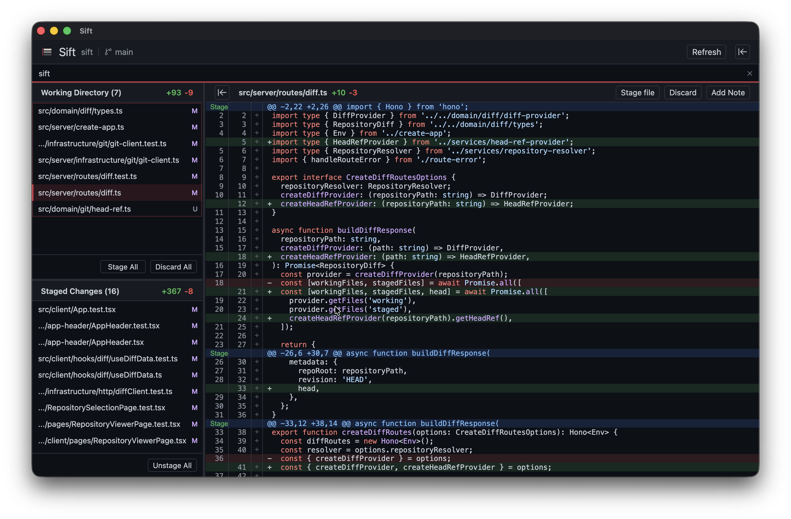

# Sift

[](https://github.com/ytakahashi/sift/releases/)
[](https://www.npmjs.com/package/@ytakahashi/sift)
[](https://github.com/ytakahashi/sift/actions/workflows/node.js.yml)
[](https://opensource.org/licenses/MIT)

> **Sift before you commit.**

A lightweight local diff viewer for inspecting changes with agent-aware ephemeral notes.

<p align="center">
  
</p>

## Features

- **3-Pane Interface**: Easily navigate between your Working Directory changes and Staged Changes,
  while viewing the diff in the main viewer.
- **Granular Git Actions**: Stage and unstage changes directly from the UI.
- **Ephemeral Notes**: Add in-memory notes to specific lines, line ranges, or entire files. This is
  perfect for jotting down self-reminders and double-checking your work before it gets etched into
  your Git history.
- **Notes MCP**: Let MCP-compatible AI agents read unresolved Notes and add review findings directly
  within your local environment.
- **Runs Entirely Locally**: Data never leaves your computer, and directory traversal is strictly
  locked to your Git repository.

## Installation

Sift can be used either as a standalone macOS app or as a command-line tool.

### macOS App

The Sift macOS app is a standalone application. It bundles its own Node.js runtime and starts the
local Sift server automatically, so Node.js and the `sift` command are not required.

Requirements:

- macOS on Apple Silicon
- Git

Download the latest app from the [Releases page](https://github.com/ytakahashi/sift/releases).

Install the command-line tool as well if you want to open the app from a terminal with
`sift open --app`, use Sift in a browser, or use commands such as `sift mcp`.

### Command-line Tool

The command-line tool runs Sift in your browser and provides terminal and MCP integration.

#### Install

Requirements:

- Node.js >= 22.12.0
- Git
- macOS, Linux, or Windows

```bash
npm install --global @ytakahashi/sift
```

#### Update and Uninstall

```bash
# Update
npm update --global @ytakahashi/sift

# Uninstall
npm uninstall --global @ytakahashi/sift
```

## Command-line Usage

```sh
sift open [path] [--app|--browser]
sift open -i [--app|--browser]
sift add  [path]
sift serve
sift mcp [--repo <path>]
```

`-h, --help` is available on `sift` itself and on every subcommand (e.g. `sift open --help`) to show
its available options and usage.

### `sift open [path]`

Open a repository in the browser or the Sift macOS app.

- `path`: Repository path to open (defaults to the current directory). Registers the repository
  automatically if it isn't already in the local Sift config. Cannot be combined with `-i`.
- `-b, --browser`: Open the browser (default).
- `-a, --app`: Open the Sift macOS application instead of the browser. Requires the Sift macOS app
  to be installed (see Installation).
- `-i, --interactive`: Pick a registered repository from an interactive list instead of using `path`
  or the current directory.

### `sift add [path]`

Register a repository in the local Sift config without opening it.

- `path`: Repository path to add (defaults to the current directory).

### `sift serve`

Start the local Sift server and print its URL, without opening any specific repository.

### `sift mcp [--repo <path>]`

Start a stdio MCP server that exposes Sift Notes to an AI agent. This command is intended to be
launched by an MCP host rather than run directly in a terminal.

Configure your MCP host with `sift` as the command and pass the repository if needed. The exact
configuration format depends on the host, but the example commands are below:

[Codex CLI](https://learn.chatgpt.com/docs/extend/mcp?surface=cli)

```sh
$ codex mcp add sift -- sift mcp
```

[Claude Code](https://code.claude.com/docs/en/mcp)

```sh
$ claude mcp add --transport stdio sift -- sift mcp
## OR
$ claude mcp add --transport stdio sift-my-project -- sift mcp --repo /absolute/path/to/my-project
```

The `--repo` option defaults to the MCP process's startup working directory.

Notes and operational details:

- The repository must be registered, but registration can happen after the MCP process starts. Run
  `sift add <path>` and retry the tool; restarting the MCP process is not required.
- Both processes use `PORT` (default: `49321`). If you override it, provide the same value to the
  HTTP server and the MCP process.
- Notes are stored in the HTTP server's memory and cleared when the server exits.

Example requests after the MCP server is connected:

<!-- prettier-ignore-start -->
> [!NOTE]
> A Sift HTTP server must be running and the target repository must be registered in Sift (e.g., via
> `sift add [path]` or `sift open [path]`).
<!-- prettier-ignore-end -->

- _"Check Sift Notes using Sift MCP and address the review comments for this repository."_
- _"Review the local diff and record each finding as a Sift Note via Sift MCP."_

## Development

### Prerequisites

- [pnpm](https://pnpm.io/)

### Setup

```bash
pnpm install
```

### Running in Development

To start Sift in development mode (which utilizes Vite's dev server):

```bash
pnpm run dev
```

### Building for Production

To build the client assets and compile the server-side TypeScript code:

```bash
pnpm run build
```

Then you can run the compiled CLI application directly from the repository:

```bash
pnpm run start
```

### Installing Globally (for local testing)

To try your local changes as the `sift` command from any Git repository on your machine:

```bash
pnpm link --global
```

### Code Quality (Linting & Formatting)

This project uses **ESLint** and **Prettier** to enforce a unified code style.

- **Check Formatting**: `pnpm run format`
- **Auto-Fix Formatting**: `pnpm run format:fix`
- **Run Linter**: `pnpm run lint`
- **Auto-Fix Lint Errors**: `pnpm run lint:fix`

### Testing

This project uses [Vitest](https://vitest.dev/) for unit testing.

- **Run Tests**: `pnpm run test`

## Tech Stack

- **Server**: [Hono](https://hono.dev/) handling routing and static file serving on Node.js.
- **Client**: [React](https://react.dev/) + [Vite](https://vitejs.dev/) with purely Vanilla CSS for
  modern, lightweight, and ultra-fast rendering.
- **MCP Server**: [Model Context Protocol](https://modelcontextprotocol.io/) TypeScript SDK for
  stdio-based AI agent integration.
